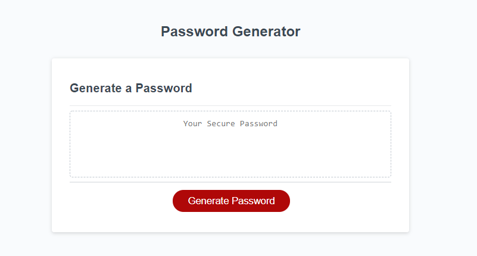
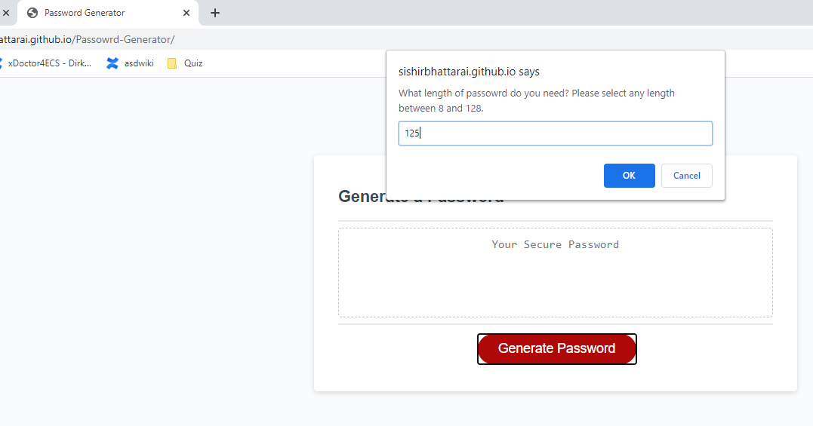
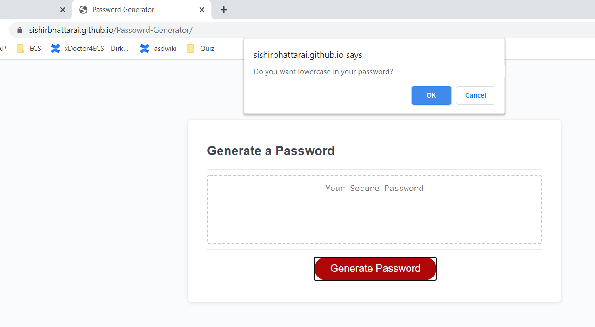
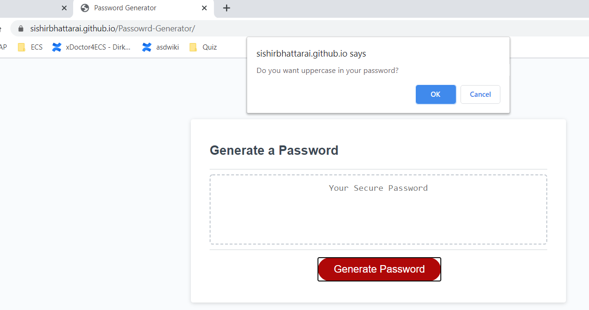
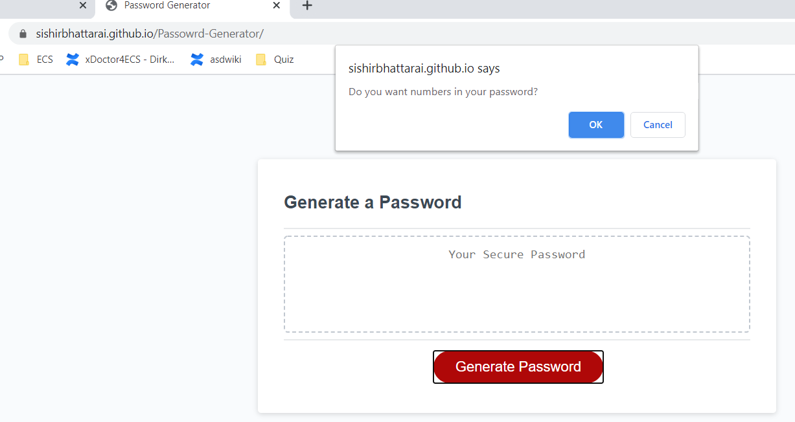
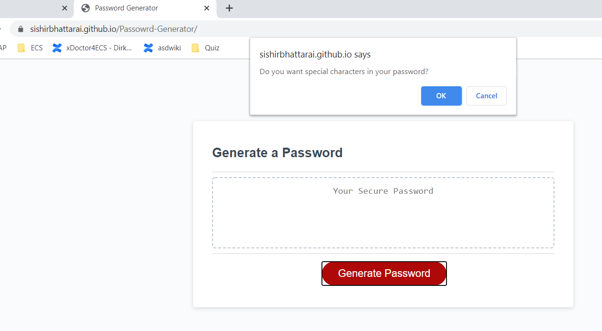
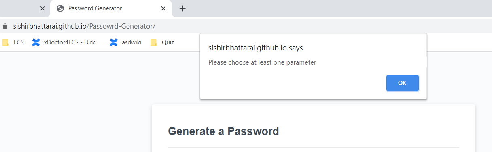
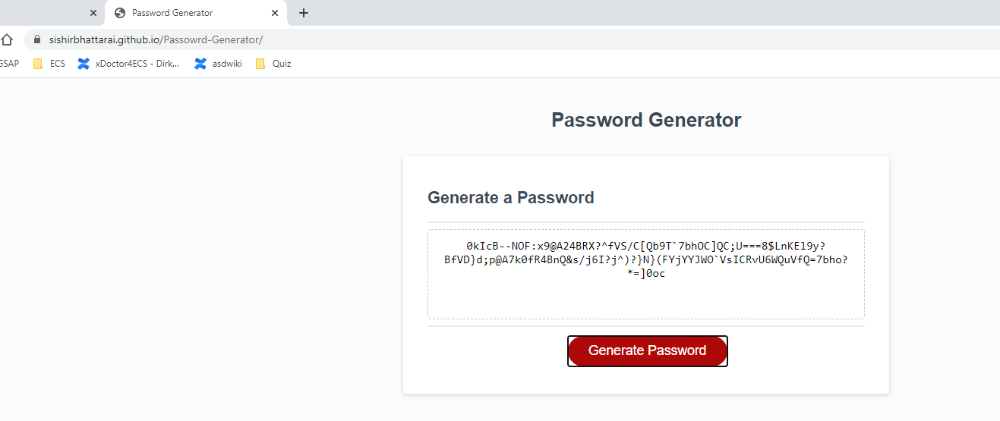

# Live deployed site: https://sishirbhattarai.github.io/Passowrd-Generator/

# Technology Used: HTML, CSS, JAVAScript, Bootstraps

# JavaScript: Password Generator

This is about creating an application that generates a random password based on user-selected criteria. This app will run in the browser and feature dynamically updated HTML and CSS powered by your JavaScript code. It will also feature a clean and polished user interface and be responsive, ensuring that it adapts to multiple screen sizes.

If you are unfamiliar with special characters, take a look at [some examples](https://www.owasp.org/index.php/Password_special_characters).

## User Story

```
AS AN employee with access to sensitive data
I WANT to randomly generate a password that meets certain criteria
SO THAT I can create a strong password that provides greater security
```

## Test:

WHEN I click the button to generate a password




THEN I choose a length of at least 8 characters and no more than 128 characters



WHEN prompted for character types to include in the password
THEN I choose lowercase, uppercase, numeric, and/or special characters









WHEN none of the above prompts are answered, it will alert to choose atleast one parameter.



Password is genearted as below




## Creator Contact:

Name: Sishir Bhattarai
Email: sishir.bhattarai@outlook.com

- - -
© 2019 Trilogy Education Services, a 2U, Inc. brand. All Rights Reserved.
